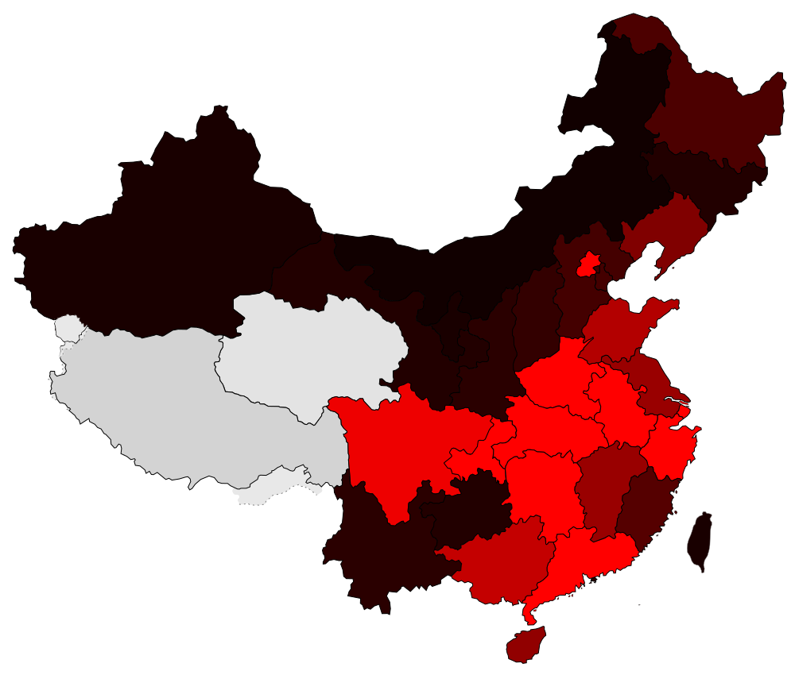

# 2019 Wuhan Coronavirus data (2019-nCoV)

This public repository archives data over time from various public sources on the web.

Data is presented as timestamped CSV files, using the Beijing (CST) timezone.

It is hoped that this data will be useful to those producing visualizations or analyses.

Code is included.

## Sample visualization



Generates a static SVG. Currently color selection is quite bad based on a simple threshold algorithm. Source was [this SVG from wikimedia commons](https://upload.wikimedia.org/wikipedia/commons/f/fe/China_blank_province_map.svg).

## Sample commands

The following command sequence will grab data from DXY and render it.

```
cd data-sources/dxy/
./get-dxy
./process-dxy >data/sample.csv
cd data
../../../vizualisation/simple-svg/visualize-from-dxy-csv sample.csv
```

You now have a `sample.svg` file which contains the visualized form of the CSV output.

## Sources used

### [BNO](https://bnonews.com/index.php/2020/01/the-latest-coronavirus-cases/)

Includes detail on foreign sources, individual provincial update URLs. Updated once per day or so.

 * [Direct link to latest data](https://raw.githubusercontent.com/globalcitizen/2019-wuhan-coronavirus-data/master/data-sources/bno/data/20200125-055800-bno-2019ncov-data.csv)

### [DXY](https://3g.dxy.cn/newh5/view/pneumonia)

High level information without specific source URLs. However, this is updated frequently and appears to be the best available data.

 * [Direct link to latest data](https://raw.githubusercontent.com/globalcitizen/2019-wuhan-coronavirus-data/master/data-sources/dxy/data/20200125-162000-dxy-2019ncov-data.csv)

## TODO

 * Global view
 * Better color selection (plan is to move from opaque fill color to changing the alpha/opacity/transparency level)
 * Convert disaparate data sources in to singular SQLite database
 * More visualization options:
   * [amcharts](https://www.amcharts.com/demos/map-with-curved-lines/?theme=dark) (icky licensing but looks cool)
   * [d3.js](https://d3js.org/) and [d3-china-map](https://github.com/clemsos/d3-china-map) (good option but possibly overkill)
   * [jvectormap](https://jvectormap.com/) and [jvectormap china](https://jvectormap.com/maps/countries/china/) (good option but no cities)
   * [kartograph](http://kartograph.org/) (good option)
 * Add other sources, eg. [English Wikipedia](https://en.wikipedia.org/wiki/2019%E2%80%9320_Wuhan_coronavirus_outbreak) (although it generally lags DXY on updates, the summary table is good for international data citations)

## Links of note

 * *[Novel coronavirus 2019-nCoV: early estimation of epidemiological parameters and epidemic predictions](https://www.medrxiv.org/content/10.1101/2020.01.23.20018549v1.full.pdf)* (2020-01-23)
   * __Only 5% of cases are likely reported in official figures of confirmed cases.__

## Other projects

 * [BlankerL's DXY-2019-nCoV-Crawler](https://github.com/BlankerL/DXY-2019-nCoV-Crawler) and [API](http://lab.isaaclin.cn/nCoV/)
 * [yitao94's 2019-nCoV python-based DXY crawler](https://github.com/yitao94/2019-nCoV)
