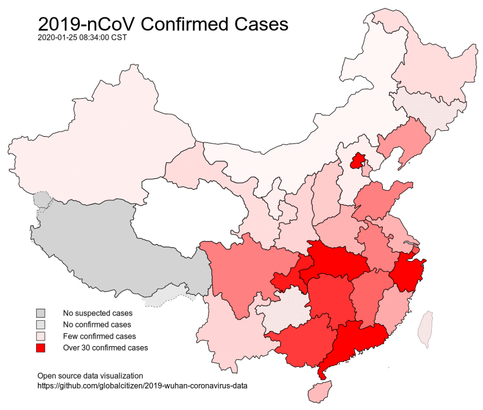
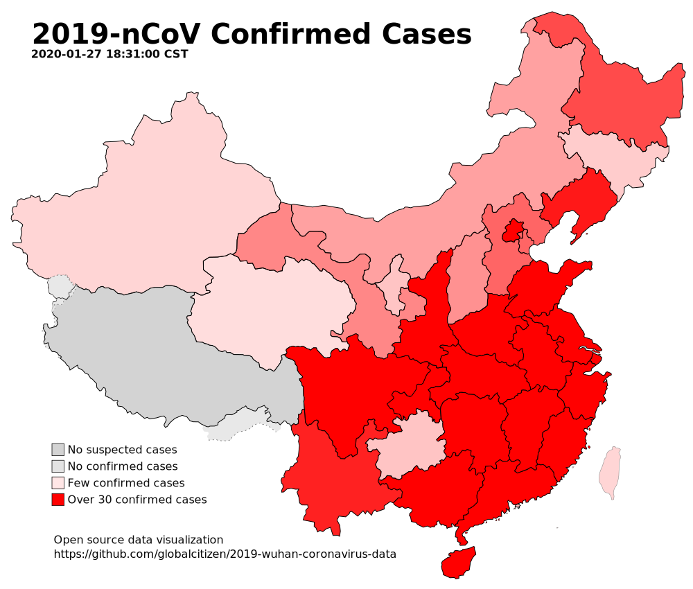

# 2019 Wuhan Coronavirus data (2019-nCoV)

This public repository archives data over time from various public sources on the web.

Data is presented as timestamped CSV files, for maximum compatibility.

It is hoped that this data will be useful to those producing visualizations or analyses.

Code is included.

## Sample animation



## Sample visualization




Generates static SVGs. 

Source images were [this one](https://upload.wikimedia.org/wikipedia/commons/f/fe/China_blank_province_map.svg) and [this one](https://commons.wikimedia.org/wiki/File:BlankMap-World.svg).

## Generating

### China

For a China map, the following command sequence will grab data from DXY and render it.

```
cd data-sources/dxy/
./process-dxy
```

You now have timestamped JSON, CSV and SVG files in the `data-sources/dxy/data/` subdirectory.

### World

For a world map, the process is similar.

```
cd data-sources/bno/
./get-bno
./process-dno >data/sample.csv
../../../visualization/bno-world-svg/bno-world-csv2svg sample.csv
```

You now have a `sample.svg` file which contains the visualized form of the CSV output showing the world.


## Sources used

### [BNO](https://bnonews.com/index.php/2020/01/the-latest-coronavirus-cases/)

Includes detail on foreign sources, individual provincial update URLs. Updated once per day or so.
 * Data is timestamped in US Eastern Standard Time (ET) timezone
 * [Direct link to latest data](https://raw.githubusercontent.com/globalcitizen/2019-wuhan-coronavirus-data/master/data-sources/bno/data/20200127-041800-bno-2019ncov-data.csv)

### [DXY](https://3g.dxy.cn/newh5/view/pneumonia)

High level information without specific source URLs. However, this is updated frequently and appears to be the best available data.

 * Data is timestamped in Beijing (CST) timezone
 * [Direct link to latest data](https://raw.githubusercontent.com/globalcitizen/2019-wuhan-coronavirus-data/master/data-sources/dxy/data/20200127-183100-dxy-2019ncov-data.csv)

## TODO

 * Add key to global view
 * Convert disparate data sources in to singular SQLite database
 * Add cities (needs an improved visualization system)
 * More visualization options:
   * [amcharts](https://www.amcharts.com/demos/map-with-curved-lines/?theme=dark) (icky licensing but looks cool)
   * [d3.js](https://d3js.org/) and [d3-china-map](https://github.com/clemsos/d3-china-map) (good option but possibly overkill)
   * [jvectormap](https://jvectormap.com/) and [jvectormap china](https://jvectormap.com/maps/countries/china/) (good option but no cities)
   * [kartograph](http://kartograph.org/) (good option)
 * Add other sources, eg.
   * [English Wikipedia](https://en.wikipedia.org/wiki/2019%E2%80%9320_Wuhan_coronavirus_outbreak) (although it generally lags DXY on updates, the summary table is good for international data citations)
   * [Tencent live monitoring page](https://news.qq.com//zt2020/page/feiyan.htm)

## Links of note

 * *[Real-time nowcast and forecast on the extent of the Wuhan CoV outbreak, domestic and international spread](https://www.med.hku.hk/f/news/3549/7418/Wuhan-coronavirus-outbreak_AN-UPDATE_20200127.pdf)* (2020-01-27)
   * __2019-nCoV may be about to become a global epidemic__
   * __Self-sustaining human-to-human spread is already present in all major Chinese cities__
 * *[Novel coronavirus 2019-nCoV: early estimation of epidemiological parameters and epidemic predictions](https://www.medrxiv.org/content/10.1101/2020.01.23.20018549v1.full.pdf)* (2020-01-23)
   * __Only 5% of cases are likely reported in official figures of confirmed cases.__

## Other projects

 * [BlankerL's DXY-2019-nCoV-Crawler](https://github.com/BlankerL/DXY-2019-nCoV-Crawler) and [API](http://lab.isaaclin.cn/nCoV/)
 * [yitao94's 2019-nCoV python-based DXY crawler](https://github.com/yitao94/2019-nCoV)
